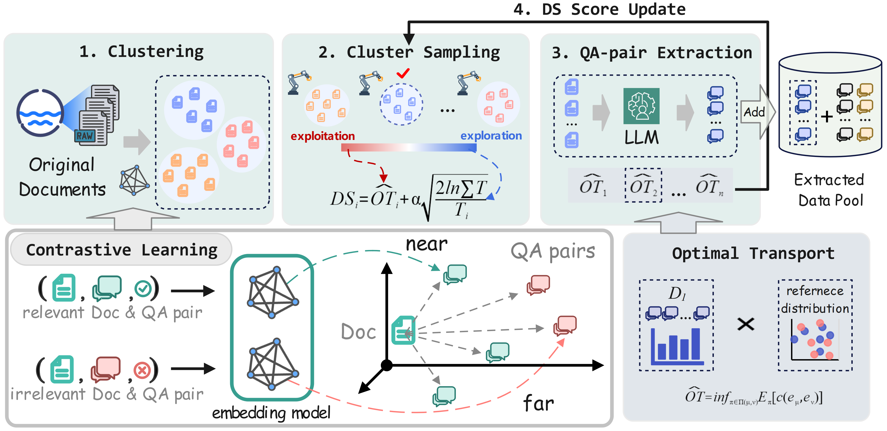

# **EQUAL: Efficient Scalable Data Extraction Framework for Instruction Tuning**

This repository contains the code for our paper **[EQUAL: Efficient Scalable Data Extraction Framework for Instruction Tuning]** published at **ICML 2025**. In this work, we propose a **multi-stage framework** to efficiently extract high-quality instruction tuning data from web documents, reducing computational costs while improving model performance.



---

## 🔗 **Quick Links**
- [EQUAL: Efficient Scalable Data Extraction Framework for Instruction Tuning](#equal-efficient-scalable-data-extraction-framework-for-instruction-tuning)
  - [Install Requirements](#install-requirements)
  - [Project Structure](#project-structure)
  - [Data Extraction Pipeline](#data-extraction-pipeline)
    - [Step 1: Document Clustering](#step-1-document-clustering)
    - [Step 2: Data Selection & QA Pair Extraction](#step-2-data-selection--qa-pair-extraction)
    - [Step 3: Fine-tuning with Extracted Data](#step-3-fine-tuning-with-extracted-data)
  - [Model Evaluation](#model-evaluation)
  - [Bugs or Questions?](#bugs-or-questions)
  - [Citation](#citation)

---

## **Install Requirements**

### **Data Extraction Environment**

To set up the data extraction environment, we recommend using **Python 3.8** or later and the following dependencies. The tools used for document clustering and QA pair extraction require the following:

The key Python packages required for data extraction include:
- **PyTorch** (>= 1.9.0)
- **transformers** (for language model interaction)
- **numpy** (for data manipulation)
- **scikit-learn** (for clustering)
- **faiss-cpu** (for efficient similarity search)
  
#### **Setting up the Data Extraction Environment**:
1. First, install **PyTorch** and the required libraries:
    ```bash
    pip install torch==2.1.2 torchvision torchaudio
    pip install transformers scikit-learn faiss-cpu numpy
    ```

2. Clone the repository and install the dependencies:
    ```bash
    git clone https://github.com/your-repo/EQUAL.git
    cd EQUAL
    pip install -r requirements.txt
    ```

---

### **Optimal Transport Calculation Environment**

To compute **Optimal Transport** (OT) distances, we use the **IPOT** implementation, which is based on the paper ["A Fast Proximal Point Method for Computing Exact Wasserstein Distance"](https://arxiv.org/abs/1802.04307). The environment setup for optimal transport calculation is as follows:

#### **Dependencies**
```bash
pip install numpy matplotlib pot==0.4.0 tensorflow==1.1.0
```

---

## **Project Structure**
The project is organized as follows:
```
EQUAL/
│── clustering/           # Step 1: Document Clustering
│── data_synthesis/       # Step 2: Data Selection & QA Pair Extraction
│── training/             # Step 3: Fine-tuning with Extracted Data
│── data/                 # Data storage
│── requirements.txt      # Dependency list
│── scripts/              # Utility scripts
│── README.md             # Project documentation
└── setup.py              # Package setup
```

---

## **Data Extraction Pipeline**

EQUAL framework consists of three main stages:

### **Step 1: Document Clustering**
- **Goal**: Extract high-quality instruction tuning data from web documents to enhance the performance of large language models (LLMs). Traditional instruction data generation methods often rely on models generating data, which leads to insufficient data diversity. Alternatively, extracting QAs from a large corpus of documents may result in high computational costs and irrelevant data for downstream tasks.
  
  EQUAL optimizes this process by clustering documents using **contrastive learning**, followed by efficient selection of QA pairs from well-aligned clusters. This reduces computational costs and improves the quality of the extracted data.

- **Method**:
  1. Use **contrastive learning** to align document embeddings with QA pair embeddings.
  2. Perform **k-means clustering** (or DBSCAN) on document embeddings.
  3. Assign each document to an appropriate cluster for efficient sampling in later stages.

- **Run Code**:
  ```bash
  python clustering/cluster_documents.py --input data/raw_docs.json --output data/clusters.json
  ```

---

### **Step 2: Data Selection & QA Pair Extraction**
- **Goal**: Identify and extract high-quality QA pairs from the selected document clusters.
- **Method**:
  1. Use the **Multi-Armed Bandit (MAB)** strategy to iteratively sample valuable clusters.
  2. Extract QA pairs from the selected documents using **LLMs** (e.g., Qwen2.5-72B).
  3. Use **Optimal Transport (OT)** scores to evaluate the alignment of the extracted QA pairs with downstream task distributions.
  
- **Run Code**:
  ```bash
  python data_synthesis/extract_qa_pairs.py --input data/clusters.json --output data/extracted_qa.json
  ```

---

### **Step 3: Fine-tuning with Extracted Data**
- **Goal**: Fine-tune LLMs with high-quality instruction tuning data.
- **Method**:
  1. Use **Full Fine-tuning** or **LoRA (Low-Rank Adaptation)** for training.
  2. Fine-tune the model using extracted QA pairs to improve its instruction-following capabilities.
  3. Evaluate the model's performance on datasets such as **AutoMathText**, **StackOverflow**, **GSM8K**, and **MBPP**.

- **Run Code**:
  ```bash
  python training/fine_tune.py --model mistral-7b --data data/extracted_qa.json --epochs 4
  ```

---

## **Model Evaluation**
To evaluate the model after fine-tuning, run:
```bash
python training/evaluate.py --model_path checkpoints/mistral-7b --test_set datasets/gsm8k.json
```
**Expected Results**:
- **Accuracy Improvement**: +2.5% on **GSM8K** and **MBPP** datasets.
- **Computational Cost Reduction**: Reduced **FLOPs** by approximately **5×** compared to traditional methods.

---

## **Bugs or Questions?**
If you encounter any issues or have questions, feel free to open an **issue** or contact us.
